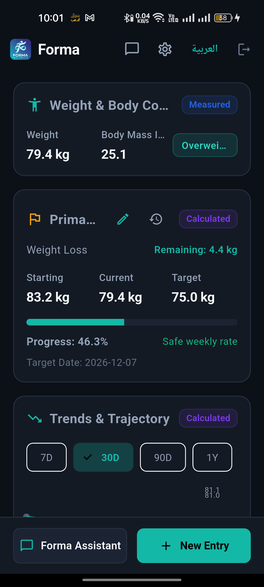
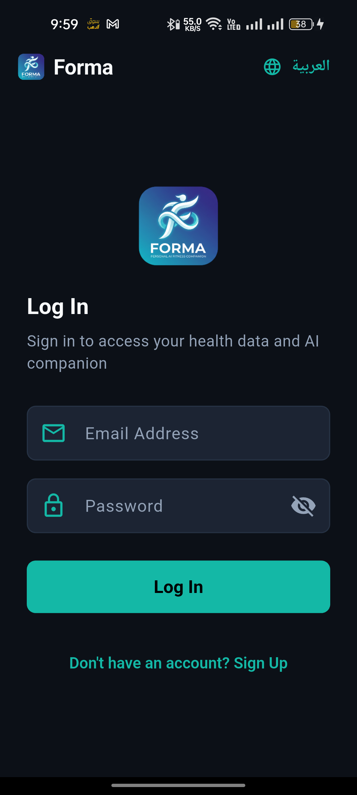
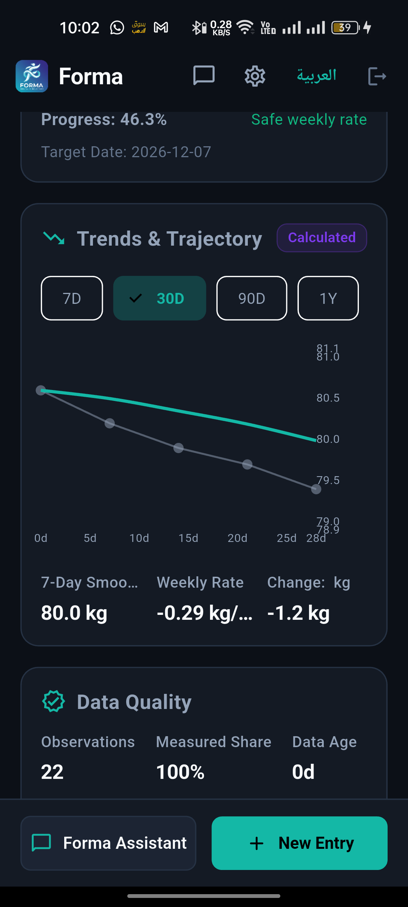
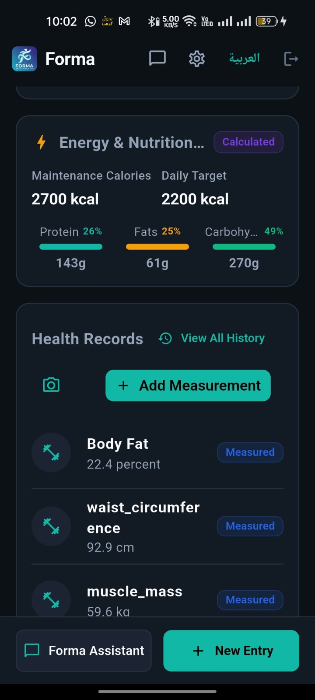
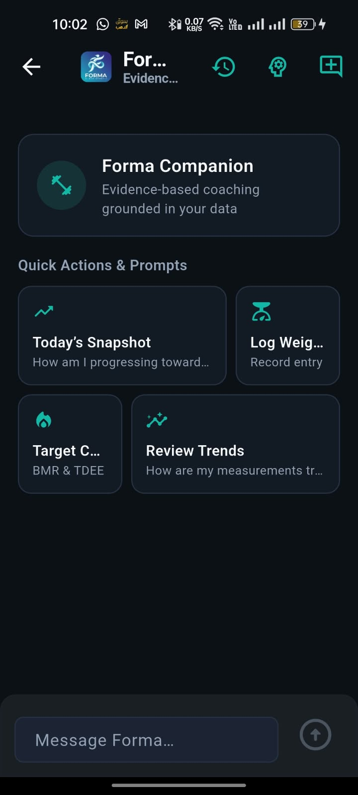
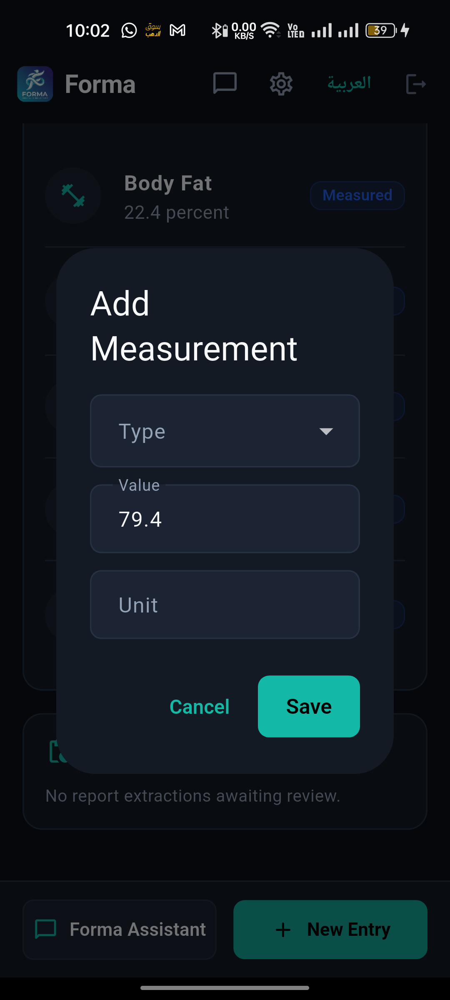
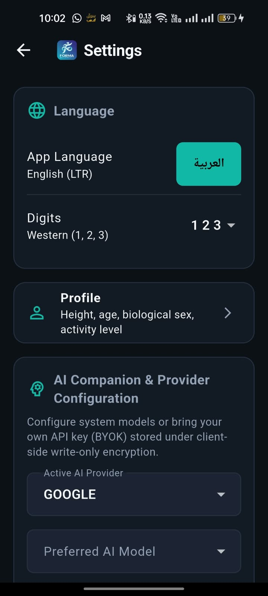
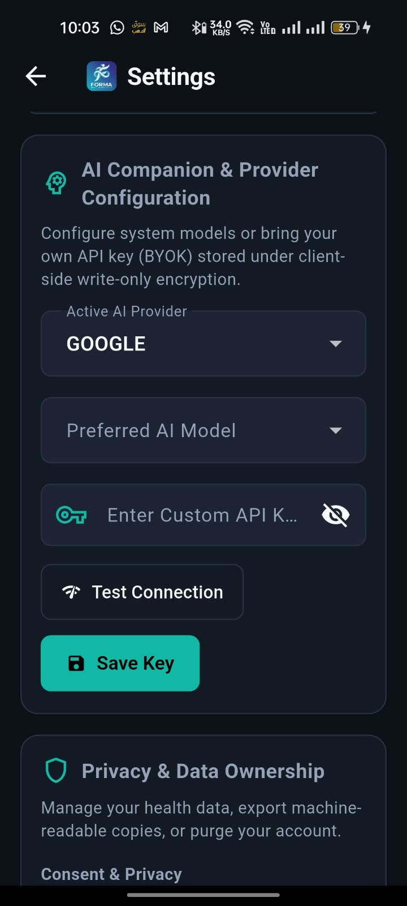

<div align="center">


# Forma

### Your Personal AI Health & Fitness Companion

**Track. Understand. Improve — with an AI that never writes to your health record without your explicit consent.**

[](mobile)
[](backend)
[](backend)
[](backend)
[](backend)
[](mobile)
[]()



**[Download](#-download--installation) · [Quick Start](#-quick-start-zero-to-running) · [API Reference](#-complete-api-reference) · [Architecture](#-system-architecture)**

</div>

---

## Why Forma?

Most health apps collect your data and guess. **Forma is engineered like a medical system**: every number carries proof of where it came from, every AI suggestion waits for your approval before it touches your record, and every byte is isolated at the database level — not just in application code.

> **Zero-tolerance data integrity.** No fabricated metrics. No silent overwrites. No AI hallucinations in your health record. Ever.

<table>
<tr>
<td width="33%">

### 🛡️ Safety-First AI
AI operates through a strict **Propose → Confirm → Commit** lifecycle. It can *suggest* logging a measurement or updating a goal — but nothing is written until you tap confirm, producing a receipt-backed audit trail.

</td>
<td width="33%">

### 🔒 Fortress Privacy
PostgreSQL **Row-Level Security** on every domain table + application-level filters = double isolation. Encrypted BYOK credentials, automated PII/biometric log redaction, and full GDPR export & delete.

</td>
<td width="33%">

### 🌍 True Bilingual Parity
Native **Arabic (RTL)** and **English (LTR)** across every screen, notification, and AI conversation — including Eastern Arabic (٠١٢٣) and Western (0123) numeral systems.

</td>
</tr>
</table>

---

## 📱 Real Screenshots

*Captured live from the app running on a physical Android device against the real backend.*

<table>
<tr>
<td align="center"><br /><b>Secure Sign-In</b><br /><sub>JWT auth · encrypted token storage</sub></td>
<td align="center"><br /><b>Health Dashboard</b><br /><sub>Body metrics · goal progress · safety badges</sub></td>
<td align="center"><br /><b>Trends & Trajectory</b><br /><sub>Smoothed trends · weekly rate · data quality</sub></td>
<td align="center"><br /><b>Energy & Health Records</b><br /><sub>TDEE · calorie target · macro split</sub></td>
</tr>
<tr>
<td align="center"><br /><b>AI Companion</b><br /><sub>Streaming chat · quick actions · evidence-based</sub></td>
<td align="center"><br /><b>Quick Entry</b><br /><sub>Catalog-driven types · unit-aware input</sub></td>
<td align="center"><br /><b>Settings & Language</b><br /><sub>AR/EN toggle · numeral systems · profile</sub></td>
<td align="center"><br /><b>BYOK AI Provider</b><br /><sub>Your own key · encrypted · test connection</sub></td>
</tr>
</table>

---

## ✨ What Forma Does — Complete Feature Map

### 🧍 Body & Measurements
- **17-type measurement catalog**: weight, height, BMI (derived), body fat %, body water %, muscle mass, bone mass, visceral fat, and 8 circumference types (waist, chest, hip, neck, shoulder, thigh, bicep, calf — bilateral where applicable).
- **Append-only observations**: facts are never overwritten — corrections create supersession lineage; mistakes are voided with reasons, never deleted silently.
- **Canonical unit conversion**: enter in kg/lb/st, cm/in/ft — Forma stores the original value *and* the normalized SI value side-by-side.
- **Provenance on every value**: each observation links to a provenance record (origin type, epistemic class — measured/calculated/estimated/asserted — confidence score, review state).

### 🎯 Goals & Projections
- Goal types: **weight loss, muscle gain, maintenance, general fitness** — with versioned targets (`goal_versions`) and full history.
- **Clinical safe-rate guardrails**: unsafe weekly rates are flagged or refused with explanations.
- Live progress percentage, remaining delta, and **projected target dates** computed deterministically.

### ⚡ Energy & Nutrition Engine
- Deterministic **BMI, BMR, TDEE** calculations in pure code (no AI arithmetic).
- Daily calorie targets and **macro splits** (protein/fat/carbs grams + %) tailored to your profile and goal.
- Every computed figure is tagged `Calculated` so you always know its epistemic origin.

### 📊 Analytics & Data Quality
- **Precomputed health snapshots** for instant dashboard loads, with watermark-based drift detection and deterministic reconciliation.
- **Trend analysis** over 7D / 30D / 90D / 1Y windows with 7-day smoothing, weekly rate, and net change.
- **Data quality scoring**: observation counts, measured-share percentage, staleness, and anomaly detection.

### 🤖 AI Companion (Controlled Actions)
- Streaming conversational assistant (SSE) with **context engine** that assembles your health context under a strict token budget.
- **Action proposals**: the AI can propose `log_measurement`, `update_goal`, or `save_memory` — each with a human-readable diff preview, expiry, idempotency key, and confirm/decline endpoints.
- **Persistent assistant memories** (preferences, facts, routines, constraints) you can inspect and delete.
- **BYOK (Bring Your Own Key)**: plug in your own Google Gemini / OpenAI / Anthropic key — stored AES-encrypted server-side; test connectivity from Settings.
- **Content-free traces**: telemetry records operational metadata only — raw prompts and biometrics never hit the logs.

### 📷 Multimodal Intelligence
- Upload lab reports or scale photos → vision extraction pipeline → **draft staging area**.
- Review, edit fields, then **commit** (writes real observations with `ai_extraction` provenance) or discard. Nothing auto-writes.

### 🔐 Accounts, Sessions & Privacy
- Argon2-hashed passwords, short-lived JWT access tokens + rotating refresh-token sessions.
- **Session management**: list active sessions, revoke one, or log out everywhere.
- **Consent ledger**: ToS, health-data processing, and AI third-party processing are separate, withdrawable consents — withdrawing AI consent blocks AI calls server-side (403 `AI_CONSENT_REQUIRED`).
- **GDPR endpoints**: full portable export and cascading account purge.

---

## 🏗️ System Architecture

```
┌─────────────────────┐         HTTPS / SSE          ┌──────────────────────────────┐
│   Flutter Mobile    │ ◄──────────────────────────► │   Fastify Modular Monolith   │
│  (Android · iOS ·   │     JWT access + refresh     │  ┌────────────────────────┐  │
│   Windows · Web)    │                              │  │ identity · profile     │  │
│                     │                              │  │ measurements · goals   │  │
│  Riverpod · intl ·  │                              │  │ calculations · analytics│ │
│  secure storage ·   │                              │  │ assistant · ai gateway │  │
│  fl_chart · AR/EN   │                              │  │ multimodal · privacy   │  │
└─────────────────────┘                              │  │ audit · integrations   │  │
                                                     │  └──────────┬─────────────┘  │
                                                     │             ▼                │
                                                     │   PostgreSQL 16+ (RLS on    │
                                                     │   every table, append-only  │
                                                     │   observations, audit log)  │
                                                     └──────────────────────────────┘
```

**Design invariants enforced by automated tests:**

| # | Invariant | Enforcement |
|---|-----------|-------------|
| 1 | AI has **no direct DB access** | Context engine + typed tool calls only |
| 2 | **No AI value enters the health record** without confirmation | Receipt-backed proposal engine |
| 3 | **Facts never overwritten** | Append-only observations + supersession lineage |
| 4 | **Calculations in pure code** | Deterministic engine with clinical safety floors |
| 5 | **Every value has provenance & confidence** | FK to `provenance_records` |
| 6 | **Double user isolation** | App filters + PostgreSQL RLS on all tables |
| 7 | **Bounded AI context** | Tiered assembly under token budget |
| 8 | **Health content never in logs** | Automated PII/biometric redaction |
| 9 | **Estimates ≠ measurements** | Epistemic class: measured / calculated / estimated / asserted |
| 10 | **Export & delete everywhere** | GDPR portable export + cascading purge |

---

## ⬇️ Download & Installation

```bash
git clone https://github.com/Ziad-Abaza/forma.git
cd forma
```

### Prerequisites

| Tool | Version | Purpose |
|------|---------|---------|
| **Node.js** | ≥ 20 (22/24 LTS recommended) | Backend runtime |
| **npm** | ≥ 10 | Backend dependencies |
| **Docker + Compose** | any recent | Local PostgreSQL 18 & prod images |
| **Flutter SDK** | ≥ 3.24 (Dart ≥ 3.13) | Mobile app |

---

## 🚀 Quick Start — Zero to Running

### 1️⃣ Backend

```bash
cd backend

# Configure environment (fill in secrets — see table below)
cp .env.example .env

# Start local PostgreSQL 18 (Docker)
docker compose up -d

# Install deps, run migrations, start dev server
npm install
npm run migrate
npm run dev
```

✅ API live at **http://localhost:3000** — verify with `curl http://localhost:3000/health`

<details>
<summary><b>Required backend environment variables</b> (click to expand)</summary>

| Variable | Purpose |
|----------|---------|
| `DATABASE_URL` | App-role Postgres DSN (`forma_app`) |
| `DATABASE_URL_MIGRATIONS` | Superuser DSN for `npm run migrate` |
| `FORMA_APP_DB_PASSWORD` | Password provisioned for the `forma_app` role |
| `JWT_ACCESS_SECRET` | ≥32 chars — `openssl rand -hex 32` |
| `JWT_REFRESH_SECRET` | ≥32 chars — `openssl rand -hex 32` |
| `ENCRYPTION_MASTER_KEY` | 64 hex chars (32 bytes) — encrypts BYOK keys |
| `GEMINI_API_KEY` | *Optional* — server-side AI default; users can BYOK instead |
| `LOCAL_SERVER` | `true` → bind `0.0.0.0` for physical devices on LAN |
| `CORS_ORIGINS` | Comma-separated allowlist (production) |

</details>

<details>
<summary><b>Optional: synthetic demo data</b></summary>

```bash
# Requires explicit opt-in — never runs accidentally, never in production
FORMA_SEED_CONFIRM=RESET_LOCAL_DB npm run seed
```

Creates `dev.user@forma.test` with a generated password (printed once), a profile, a baseline measurement, a goal, and assistant memories.
</details>

### 2️⃣ Mobile App

```bash
cd mobile
cp .env.example .env   # set API_BASE_URL — see below
flutter pub get
flutter gen-l10n       # generate AR/EN localization delegates
flutter run --dart-define-from-file=.env
```

**`API_BASE_URL` by target:**

| Target | Value |
|--------|-------|
| iOS sim / desktop / web | `http://localhost:3000` |
| Android emulator | `http://10.0.2.2:3000` |
| Physical device (same Wi-Fi) | `http://<YOUR_PC_IP>:3000` + `LOCAL_SERVER=true` on backend |
| Physical device over USB | `http://127.0.0.1:3000` + `adb reverse tcp:3000 tcp:3000` |

> 💡 **Auto-discovery:** with `LOCAL_SERVER=true`, the backend binds `0.0.0.0`, syncs `mobile/.env` with your LAN IP, and the app can probe the subnet for the backend automatically.

### 3️⃣ Production (Docker)

```bash
cd backend
docker build -t forma-backend .
docker run -p 3000:3000 --env-file .env forma-backend
```

Multi-stage build, non-root `forma:forma` user, `dumb-init` PID-1 supervision. Probes: `GET /health` · `GET /health/live` · `GET /health/ready` (200/503) · `GET /metrics`.

---

## 📡 Complete API Reference

Base URL: `/api/v1` — Bearer JWT unless marked **public**.

### Health & Observability *(public)*
| Method | Endpoint | Description |
|--------|----------|-------------|
| GET | `/health` | Liveness + version |
| GET | `/health/live` | Process liveness probe |
| GET | `/health/ready` | DB connectivity + migration readiness |
| GET | `/metrics` | Runtime telemetry & memory stats |

### Identity & Sessions
| Method | Endpoint | Description |
|--------|----------|-------------|
| POST | `/auth/register` | Register with consent capture (ToS, health, AI) |
| POST | `/auth/login` | Issue access + rotating refresh tokens |
| POST | `/auth/refresh` | Rotate refresh token |
| POST | `/auth/logout` | Revoke current session |
| POST | `/auth/logout-all` | Revoke every session for the user |
| GET | `/auth/sessions` | List active sessions w/ device info |
| DELETE | `/auth/sessions/:id` | Revoke a specific session |
| POST | `/auth/change-password` | Change password (revokes sessions) |
| GET | `/auth/me` | Current user summary |
| PATCH | `/auth/preferences` | Locale (`en`/`ar`) + numeral system |

### Profile
| Method | Endpoint | Description |
|--------|----------|-------------|
| GET | `/profile` | Full profile (DOB, sex, height, activity, experience, constraints) |
| PUT | `/profile` | Update profile — recorded in `profile_history` |
| GET | `/profile/history` | Attribute-level change history |

### Measurements & Observations
| Method | Endpoint | Description |
|--------|----------|-------------|
| GET | `/measurements/types` | **public** — 17-type catalog w/ units, plausibility bounds, laterality |
| POST | `/measurements/observations` | Record observation (auto unit conversion + provenance) |
| GET | `/measurements/observations` | Query by type, status, date range |
| POST | `/measurements/observations/:id/supersede` | Correct a value — keeps lineage |
| POST | `/measurements/observations/:id/void` | Void with reason — never hard-deleted |
| GET | `/measurements/provenance/:id` | Full provenance record |

### Goals
| Method | Endpoint | Description |
|--------|----------|-------------|
| POST | `/goals` | Create goal + first version (safe-rate guardrails) |
| POST | `/goals/:id/versions` | New target version |
| GET | `/goals` · `/goals/primary` | List goals / primary goal w/ progress % |
| GET | `/goals/:id/versions` | Version history |
| PATCH | `/goals/:id/status` | `active` / `achieved` / `abandoned` |

### Calculation Engine *(public)*
| Method | Endpoint | Description |
|--------|----------|-------------|
| GET | `/calculations/bmi` | Body mass index |
| GET | `/calculations/bmr` | Basal metabolic rate |
| GET | `/calculations/tdee` | Total daily energy expenditure |
| GET | `/calculations/calorie-targets` | Goal-adjusted daily calories |
| GET | `/calculations/macros` | Protein/fat/carb split |
| GET | `/calculations/timeline` | Projected goal timeline |

### Analytics
| Method | Endpoint | Description |
|--------|----------|-------------|
| GET | `/analytics/snapshot` | Precomputed health snapshot |
| GET | `/analytics/snapshot/reconcile` | Force deterministic reconciliation |
| GET | `/analytics/trends/:typeCode` | Windowed trend w/ smoothing |

### AI Assistant (Controlled Actions)
| Method | Endpoint | Description |
|--------|----------|-------------|
| POST | `/assistant/chat` | Chat — `stream:true` for SSE tokens; requires AI consent |
| GET | `/assistant/conversations` | Conversation list |
| GET / DELETE | `/assistant/conversations/:id` | Read / delete conversation |
| POST | `/assistant/proposals/:id/confirm` | **Commit** a proposed action → receipt |
| POST | `/assistant/proposals/:id/decline` | Decline proposal |
| GET / POST / DELETE | `/assistant/memories` · `/:id` | Inspect & manage AI memories |

### AI Provider & BYOK
| Method | Endpoint | Description |
|--------|----------|-------------|
| GET | `/ai/config` | Active provider, model catalog, capabilities |
| PATCH | `/ai/preferences` | Model/provider selection |
| POST | `/ai/credentials` | Store BYOK key (AES-encrypted at rest) |
| DELETE | `/ai/credentials/:provider` | Remove BYOK key |
| POST | `/ai/test-connection` | Verify provider connectivity |

### Multimodal Extraction
| Method | Endpoint | Description |
|--------|----------|-------------|
| POST | `/multimodal/upload-and-extract` | Image → staged extraction draft |
| GET | `/multimodal/drafts` · `/drafts/:id` | Pending drafts |
| PUT | `/multimodal/drafts/:id/fields` | Edit extracted fields before commit |
| POST | `/multimodal/drafts/:id/commit` | Commit → real observations w/ provenance |
| DELETE | `/multimodal/drafts/:id` | Discard draft |

### Privacy & GDPR
| Method | Endpoint | Description |
|--------|----------|-------------|
| GET | `/privacy/consents` | Active consent ledger |
| POST | `/privacy/consents/:policyType/withdraw` | Withdraw consent (AI calls → 403) |
| GET | `/privacy/export` | Full portable data export |
| DELETE | `/privacy/account` | Cascading account purge |

---

## ✅ Verified Quality Gates

| Suite | Command | Status |
|-------|---------|--------|
| Backend unit + integration (Vitest, real PostgreSQL) | `cd backend && npm test` | **185 tests / 21 files — all passing** |
| Architectural invariants & RLS policies | `npm run test:arch` | Enforced |
| Backend typecheck | `npm run typecheck` | 0 errors |
| Mobile widget & unit tests | `cd mobile && flutter test` | Passing |
| Mobile static analysis | `flutter analyze` | 0 issues |
| Secret scanner (whole repo) | `node scripts/secret-scan.js` | Clean |

---

## 🗂️ Project Structure

```
forma/
├── backend/                  # Self-contained Node.js 22 + TS + Fastify monolith
│   ├── src/
│   │   ├── modules/          # identity, profile, measurements, goals,
│   │   │                     # calculations, analytics, assistant, ai,
│   │   │                     # multimodal, integrations, privacy, audit
│   │   ├── core/             # database (RLS migrations), security, logging, units
│   │   ├── eval/             # architecture guardrails + invariants audit
│   │   └── app.ts            # 58+ route definitions
│   ├── Dockerfile            # multi-stage, non-root, dumb-init
│   └── docker-compose.yml    # PostgreSQL 18 w/ healthchecks
├── mobile/                   # Flutter 3.24+ app — Android, iOS, Windows, Web
│   ├── lib/
│   │   ├── core/             # theme, API client, env config, secure storage
│   │   ├── modules/          # auth, profile, measurements, goals, analytics,
│   │   │                     # assistant, ai, multimodal, privacy
│   │   ├── presentation/     # dashboard, assistant, settings, review screens
│   │   └── l10n/             # AR (RTL) + EN (LTR) full parity
│   └── test/                 # widget + unit suites
├── screenshots/              # Real device captures used in this README
└── README.md
```

---

## 🌐 Built Bilingual — بُني ثنائي اللغة

<div dir="rtl">

**فورما ليس تطبيقاً مترجماً — بل بُني بالعربية والإنجليزية من الأساس.**
واجهة كاملة بالاتجاهين RTL/LTR، دعم الأرقام العربية الشرقية (٠١٢٣) والغربية (0123)، ومحادثات ذكاء اصطناعي باللغتين — كل ذلك بضغطة زر واحدة من شاشة الإعدادات.

</div>

---

<div align="center">

**Forma** — because your health data deserves engineering, not estimation.

`git clone https://github.com/Ziad-Abaza/forma.git`

</div>
